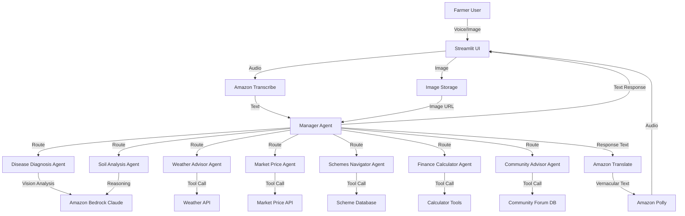

# Design Document: MissionAI Farmer Agent

## Overview

MissionAI is a voice-first, multimodal AI agent system built using the Strands Agents SDK and Amazon Bedrock (Claude 3.5 Sonnet/Sonnet 4). The system employs a multi-agent architecture where a Manager Agent orchestrates specialized sub-agents to handle different aspects of the farming lifecycle. The design prioritizes voice interaction in vernacular languages (Kannada, English, Hindi), multimodal input (voice + images), and proactive hyper-local intelligence.

The system integrates with AWS services for voice processing (Transcribe, Polly), translation (Translate), and AI reasoning (Bedrock). The frontend is built with Streamlit for rapid prototyping with mobile-friendly UI components. The architecture follows the Strands pattern of agent handoffs, tool calling, reflection, and memory management.

## Architecture

### High-Level Architecture



### Multi-Agent Architecture Pattern

The system uses a **Manager-Specialist** pattern:

1. **Manager Agent**: Central orchestrator that:
   - Receives all user requests
   - Analyzes intent using Claude's reasoning
   - Routes to appropriate specialist agent(s)
   - Maintains conversation context and memory
   - Coordinates multi-agent workflows
   - Handles language detection and translation coordination

2. **Specialist Agents**: Domain-specific agents that:
   - Handle focused tasks (diagnosis, weather, market, etc.)
   - Use custom tools and external APIs
   - Return structured responses to Manager
   - Can request handoffs to other specialists

### Technology Stack

- **Agent Framework**: Strands Agents SDK (Python)
- **AI Model**: Amazon Bedrock - Claude 3.5 Sonnet or Sonnet 4
- **Voice Input**: Amazon Transcribe (Kannada, English, Hindi)
- **Voice Output**: Amazon Polly (TTS in vernacular languages)
- **Translation**: Amazon Translate
- **Frontend**: Streamlit with mobile-responsive components
- **Audio Recording**: streamlit-audio-recorder or streamlit-webrtc
- **Image Handling**: PIL/Pillow for preprocessing, S3 for storage
- **Environment**: Python 3.9+, boto3, python-dotenv

## Components and Interfaces

### 1. Manager Agent

**Purpose**: Central orchestrator for all user interactions

**Responsibilities**:
- Intent analysis and routing
- Language detection and preference management
- Context and memory management across sessions
- Multi-agent coordination
- Error handling and fallback strategies
- New farmer onboarding

**Tools**:
- `detect_language(text: str) -> str`: Detect input language
- `get_user_context(user_id: str) -> dict`: Retrieve user profile and history
- `save_user_context(user_id: str, context: dict) -> bool`: Persist user data
- `route_to_agent(intent: str, context: dict) -> str`: Determine target agent

**Handoffs**:
- To Disease_Diagnosis_Agent: crop disease, pest identification
- To Soil_Analysis_Agent: soil health, crop recommendations
- To Weather_Advisor_Agent: weather queries, activity timing
- To Market_Price_Agent: price queries, buying/selling
- To Schemes_Navigator_Agent: government schemes, eligibility
- To Finance_Calculator_Agent: cost/profit calculations
- To Community_Advisor_Agent: community questions, local knowledge

**Memory**:
- User profile (name, location, crops, farm size)
- Conversation history (last 10 interactions)
- Language preference
- Onboarding progress

### 2. Disease Diagnosis Agent

**Purpose**: Multimodal crop disease identification and treatment recommendations

**Responsibilities**:
- Analyze crop images using Claude vision
- Identify diseases, pests, and nutrient deficiencies
- Provide severity assessment
- Recommend organic and chemical treatments
- Suggest preventive measures

**Tools**:
- `analyze_crop_image(image_url: str, crop_type: str) -> dict`: Vision analysis via Bedrock
- `get_treatment_options(disease: str, severity: str) -> list`: Retrieve treatment database
- `check_image_quality(image_url: str) -> dict`: Validate image clarity

**Input**: Image URL, crop type (optional), farmer's description
**Output**: Disease name, severity (low/medium/high), symptoms, treatment options, prevention tips

### 3. Soil Analysis Agent

**Purpose**: Soil classification and crop suitability recommendations

**Responsibilities**:
- Classify soil type from images or descriptions
- Assess fertility and nutrient levels
- Recommend suitable crops for soil/season/climate
- Provide soil improvement suggestions

**Tools**:
- `classify_soil(image_url: str, description: str) -> dict`: Soil type identification
- `assess_fertility(soil_type: str, indicators: dict) -> dict`: Fertility analysis
- `recommend_crops(soil_type: str, season: str, location: str) -> list`: Crop recommendations
- `get_soil_improvement_tips(soil_type: str, deficiencies: list) -> list`: Improvement advice

**Input**: Soil image/description, location, season
**Output**: Soil type, fertility assessment, nutrient status, crop recommendations with expected yield

### 4. Weather Advisor Agent

**Purpose**: Weather-based farming advice and proactive alerts

**Responsibilities**:
- Provide current weather and forecasts
- Generate activity-specific timing advice
- Send alerts for adverse weather
- Integrate weather with crop requirements

**Tools**:
- `get_weather_forecast(location: str, days: int) -> dict`: Fetch weather data
- `analyze_farming_conditions(weather: dict, activity: str, crop: str) -> dict`: Activity timing advice
- `check_adverse_conditions(forecast: dict) -> list`: Identify weather risks
- `generate_proactive_advice(weather: dict, crop: str, growth_stage: str) -> str`: Contextual recommendations

**Input**: Location, farming activity, crop type, growth stage
**Output**: Weather forecast, optimal timing, alerts, protective measures

### 5. Market Price Agent

**Purpose**: Real-time market intelligence and marketplace facilitation

**Responsibilities**:
- Provide real-time crop prices from multiple markets
- Facilitate produce listings with expiry tracking
- Show input products with quality ratings
- Send expiry alerts
- Prioritize sustainable products

**Tools**:
- `get_market_prices(crop: str, location: str, radius_km: int) -> list`: Fetch prices from nearby markets
- `create_listing(product: str, quantity: float, quality: str, expiry_date: str, price: float) -> dict`: Create sell listing
- `search_products(product_type: str, filters: dict) -> list`: Search marketplace
- `track_expiry(listing_id: str) -> dict`: Monitor expiry and send alerts
- `calculate_best_price(crop: str, quantity: float, markets: list) -> dict`: Price optimization

**Input**: Crop name, location, quantity, quality parameters
**Output**: Price comparisons, market recommendations, listing confirmations, expiry alerts

### 6. Schemes Navigator Agent

**Purpose**: Government scheme awareness and eligibility checking

**Responsibilities**:
- List relevant central and state schemes
- Provide detailed scheme information
- Check farmer eligibility
- Guide application process

**Tools**:
- `list_schemes(category: str, state: str) -> list`: Retrieve scheme list
- `get_scheme_details(scheme_id: str) -> dict`: Detailed scheme information
- `check_eligibility(scheme_id: str, farmer_profile: dict) -> dict`: Eligibility determination
- `get_application_steps(scheme_id: str) -> list`: Application guidance

**Input**: Farmer profile (land size, income, crop type, location)
**Output**: Scheme list, eligibility status, benefits, application steps

**Data Source**: JSON file with scheme database (mock for prototype)

### 7. Finance Calculator Agent

**Purpose**: Financial planning and profitability analysis

**Responsibilities**:
- Calculate crop profitability
- Estimate cultivation costs
- Compare crop options financially
- Account for seasonal and market variations

**Tools**:
- `calculate_profit(crop: str, area: float, selling_price: float, costs: dict) -> dict`: Profit/loss calculation
- `estimate_costs(crop: str, area: float, inputs: dict) -> dict`: Cost breakdown
- `compare_crops(crop_options: list, area: float, season: str) -> list`: Comparative analysis
- `project_returns(crop: str, area: float, market_trend: str, season: str) -> dict`: Return projections

**Input**: Crop details, area, prices, input costs
**Output**: Profit/loss, cost breakdown, ROI, comparative analysis

### 8. Community Advisor Agent

**Purpose**: Local farmer community knowledge and peer support

**Responsibilities**:
- Search community forum for similar questions
- Summarize community insights
- Store farmer experiences
- Combine AI and community advice

**Tools**:
- `search_forum(query: str, location: str, language: str) -> list`: Search past discussions
- `summarize_discussions(discussions: list) -> str`: Extract key insights
- `store_experience(farmer_id: str, topic: str, content: str, language: str) -> bool`: Save to forum
- `combine_advice(ai_recommendation: str, community_insights: list) -> str`: Merge AI and community wisdom

**Input**: Farmer question, location, language
**Output**: Community insights, combined AI + community advice

**Data Source**: Mock forum database (JSON) for prototype

## Data Models

### User Profile
```python
{
    "user_id": str,
    "name": str,
    "phone": str,
    "location": {
        "state": str,
        "district": str,
        "village": str,
        "coordinates": {"lat": float, "lon": float}
    },
    "farm": {
        "size_acres": float,
        "soil_type": str,
        "current_crops": list[str],
        "irrigation": str  # "rainfed", "drip", "flood"
    },
    "language_preference": str,  # "kannada", "english", "hindi"
    "onboarding_complete": bool,
    "created_at": str,
    "last_active": str
}
```

### Disease Diagnosis Result
```python
{
    "diagnosis_id": str,
    "crop_type": str,
    "image_url": str,
    "disease_name": str,
    "confidence": float,  # 0.0 to 1.0
    "severity": str,  # "low", "medium", "high"
    "symptoms": list[str],
    "causes": list[str],
    "treatments": {
        "organic": list[dict],  # {"name": str, "application": str, "timing": str}
        "chemical": list[dict]
    },
    "prevention": list[str],
    "estimated_yield_impact": str,
    "timestamp": str
}
```

### Soil Analysis Result
```python
{
    "analysis_id": str,
    "soil_type": str,  # "clay", "loam", "sandy", "silt", "laterite"
    "fertility": str,  # "low", "medium", "high"
    "ph_level": float,
    "nutrients": {
        "nitrogen": str,  # "deficient", "adequate", "excess"
        "phosphorus": str,
        "potassium": str,
        "organic_matter": str
    },
    "recommended_crops": list[dict],  # {"crop": str, "suitability": str, "expected_yield": str}
    "improvement_tips": list[str],
    "timestamp": str
}
```

### Weather Advisory
```python
{
    "advisory_id": str,
    "location": dict,
    "current_weather": {
        "temperature": float,
        "humidity": float,
        "rainfall": float,
        "wind_speed": float,
        "conditions": str
    },
    "forecast": list[dict],  # 7-day forecast
    "farming_advice": {
        "activity": str,
        "optimal_timing": str,
        "reasoning": str,
        "precautions": list[str]
    },
    "alerts": list[dict],  # {"type": str, "severity": str, "message": str}
    "timestamp": str
}
```

### Market Listing
```python
{
    "listing_id": str,
    "type": str,  # "sell", "buy"
    "product": str,
    "category": str,  # "produce", "seeds", "fertilizer", "pesticide"
    "quantity": float,
    "unit": str,
    "quality": str,  # "grade_a", "grade_b", "organic"
    "price_per_unit": float,
    "location": dict,
    "expiry_date": str,
    "is_sustainable": bool,
    "seller_id": str,
    "created_at": str,
    "status": str  # "active", "sold", "expired"
}
```

### Government Scheme
```python
{
    "scheme_id": str,
    "name": str,
    "name_vernacular": dict,  # {"kannada": str, "hindi": str}
    "level": str,  # "central", "state"
    "state": str,
    "category": str,  # "subsidy", "insurance", "loan", "training"
    "description": str,
    "benefits": list[str],
    "eligibility_criteria": {
        "min_land_acres": float,
        "max_land_acres": float,
        "income_limit": float,
        "crop_types": list[str],
        "other": list[str]
    },
    "application_process": list[str],
    "documents_required": list[str],
    "website": str,
    "helpline": str
}
```

### Financial Calculation
```python
{
    "calculation_id": str,
    "crop": str,
    "area_acres": float,
    "costs": {
        "seeds": float,
        "fertilizers": float,
        "pesticides": float,
        "labor": float,
        "water": float,
        "equipment": float,
        "other": float,
        "total": float
    },
    "revenue": {
        "expected_yield_kg": float,
        "price_per_kg": float,
        "total": float
    },
    "profit_loss": float,
    "roi_percentage": float,
    "break_even_price": float,
    "timestamp": str
}
```

### Community Post
```python
{
    "post_id": str,
    "farmer_id": str,
    "location": dict,
    "language": str,
    "topic": str,  # "disease", "weather", "market", "technique"
    "question": str,
    "answers": list[dict],  # {"farmer_id": str, "content": str, "helpful_count": int}
    "tags": list[str],
    "created_at": str,
    "view_count": int
}
```

## Correctness Properties

*A property is a characteristic or behavior that should hold true across all valid executions of a system—essentially, a formal statement about what the system should do. Properties serve as the bridge between human-readable specifications and machine-verifiable correctness guarantees.*

### Property 1: Language Consistency

*For any* user input in a supported language (Kannada, English, Hindi), when the system generates a response, the output language SHALL match the input language unless explicitly requested otherwise.

**Validates: Requirements 1.2, 1.3**

### Property 2: Multimodal Diagnosis Completeness

*For any* crop image uploaded for disease diagnosis, when the Disease_Diagnosis_Agent completes analysis, the response SHALL include disease name, severity assessment, and treatment recommendations.

**Validates: Requirements 2.1, 2.2**

### Property 3: Soil Analysis Output Completeness

*For any* soil analysis request (image or description), when the Soil_Analysis_Agent completes analysis, the response SHALL include soil type classification, fertility assessment, and crop recommendations.

**Validates: Requirements 3.1, 3.2, 3.3, 3.4**

### Property 4: Weather Forecast Completeness

*For any* weather information request with valid location, the Weather_Advisor_Agent SHALL return both current weather conditions and a 7-day forecast.

**Validates: Requirements 4.1**

### Property 5: Weather-Crop Integration

*For any* farming activity advice request, when weather data and crop type are available, the Weather_Advisor_Agent SHALL provide recommendations that consider both weather conditions and crop-specific requirements.

**Validates: Requirements 4.5**

### Property 6: Multi-Market Price Display

*For any* market price query for a specific crop and location, the Market_Price_Agent SHALL return prices from at least two nearby markets when available.

**Validates: Requirements 5.2**

### Property 7: Listing Completeness

*For any* produce listing creation request, the Market_Price_Agent SHALL require and store quantity, quality, and expiry information.

**Validates: Requirements 5.3, 5.4**

### Property 8: Expiry Alert Generation

*For any* active listing with an expiry date, when the current date is within 3 days of expiry, the Market_Price_Agent SHALL generate an alert.

**Validates: Requirements 5.5**

### Property 9: Sustainable Product Prioritization

*For any* product search results containing both sustainable and non-sustainable options, the Market_Price_Agent SHALL rank sustainable/organic products higher in the result list.

**Validates: Requirements 5.6**

### Property 10: Scheme Information Completeness

*For any* government scheme query, when the Schemes_Navigator_Agent provides scheme details, the response SHALL include benefits, eligibility criteria, and application process.

**Validates: Requirements 6.2**

### Property 11: Eligibility Determination Accuracy

*For any* farmer profile and scheme combination, the Schemes_Navigator_Agent SHALL produce consistent eligibility results when given the same input parameters.

**Validates: Requirements 6.3**

### Property 12: Financial Calculation Accuracy

*For any* profit calculation with crop details and selling price, the Finance_Calculator_Agent SHALL return a result where profit equals revenue minus total costs.

**Validates: Requirements 7.1**

### Property 13: Cost Estimation Completeness

*For any* crop cost estimation request, the Finance_Calculator_Agent SHALL include costs for seeds, fertilizers, labor, and water in the breakdown.

**Validates: Requirements 7.2**

### Property 14: Crop Comparison Completeness

*For any* crop comparison request with multiple crop options, the Finance_Calculator_Agent SHALL provide financial metrics (profit, ROI, costs) for each crop option.

**Validates: Requirements 7.3**

### Property 15: Community Forum Round-Trip

*For any* farmer experience stored in the community forum, retrieving posts by the same topic and location SHALL return the stored experience in the results.

**Validates: Requirements 8.3**

### Property 16: Combined Advice Composition

*For any* advice response from the Community_Advisor_Agent, when both AI recommendations and community insights are available, the response SHALL include elements from both sources.

**Validates: Requirements 8.4**

### Property 17: Intent-Based Routing Correctness

*For any* user request containing disease-related keywords (disease, pest, spots, wilting), the Manager_Agent SHALL route to the Disease_Diagnosis_Agent.

**Validates: Requirements 9.1**

### Property 18: Ambiguity Handling

*For any* user request that matches multiple agent domains with equal confidence, the Manager_Agent SHALL ask clarifying questions before routing.

**Validates: Requirements 9.3**

### Property 19: Context Preservation Across Handoffs

*For any* multi-agent conversation, when the Manager_Agent hands off from Agent A to Agent B, information provided to Agent A SHALL be available to Agent B without the user repeating it.

**Validates: Requirements 9.5**

### Property 20: Session Memory Round-Trip

*For any* user session data (profile, preferences, history) stored by the Manager_Agent, when the same user returns in a new session, the Manager_Agent SHALL retrieve and use the stored data.

**Validates: Requirements 13.1, 13.3**

### Property 21: Personalized Recommendations

*For any* two farmers with different stored profiles (different crops, locations, or practices), the Manager_Agent SHALL generate different recommendations when asked the same question.

**Validates: Requirements 13.2**

### Property 22: Data Deletion Completeness

*For any* user requesting data deletion, after the Manager_Agent processes the deletion, subsequent queries for that user's data SHALL return empty or default values.

**Validates: Requirements 13.5**

### Property 23: Input Validation for Calculations

*For any* financial calculation request with invalid inputs (negative quantities, zero prices, missing required fields), the Finance_Calculator_Agent SHALL reject the request with a descriptive error message.

**Validates: Requirements 14.3**

### Property 24: Error Handling for Tool Failures

*For any* tool call that fails (API timeout, invalid response, service error), the calling agent SHALL catch the error and return a user-friendly error message rather than crashing.

**Validates: Requirements 11.6, 14.5**

### Property 25: Offline Data Access

*For any* previously cached response data, when network connectivity is unavailable, the system SHALL allow retrieval of the cached data without requiring network access.

**Validates: Requirements 15.2**

### Property 26: Online Sync After Offline

*For any* user actions performed while offline (queries, data updates), when network connectivity is restored, the Manager_Agent SHALL sync the pending actions with the backend.

**Validates: Requirements 15.3**

## Error Handling

### Voice Processing Errors

1. **Transcription Failure**: If Amazon Transcribe fails or returns low-confidence transcription:
   - Prompt user to speak again more clearly
   - Offer text input as fallback
   - Log error for monitoring

2. **Language Detection Failure**: If language cannot be detected:
   - Default to user's stored language preference
   - If no preference, prompt user to select language
   - Continue with English as last resort

3. **TTS Failure**: If Amazon Polly fails:
   - Display text response only
   - Log error and retry in background
   - Notify user that audio is temporarily unavailable

### Image Processing Errors

1. **Poor Image Quality**: If image is too blurry, dark, or unclear:
   - Return specific guidance: "Please take a clearer photo in good lighting, focusing on the affected area"
   - Show example of good vs. bad image quality
   - Allow retry

2. **Unsupported Image Format**: If image format is not supported:
   - Return error with supported formats (JPEG, PNG)
   - Prompt user to convert or retake photo

3. **Vision Analysis Failure**: If Claude vision API fails:
   - Retry once with exponential backoff
   - If still fails, offer text-based diagnosis option
   - Log error for investigation

### Agent Routing Errors

1. **Ambiguous Intent**: If Manager cannot determine intent with >70% confidence:
   - Ask clarifying question: "Are you asking about [Option A] or [Option B]?"
   - Provide 2-3 most likely options
   - Allow user to specify directly

2. **No Matching Agent**: If request doesn't match any specialist:
   - Acknowledge limitation: "I'm not sure I can help with that yet"
   - Suggest related capabilities
   - Offer to connect with community forum

3. **Agent Handoff Failure**: If specialist agent fails:
   - Catch error in Manager
   - Apologize and explain issue
   - Offer alternative approach or agent
   - Log for debugging

### External API Errors

1. **Weather API Failure**:
   - Use cached weather data if available (< 6 hours old)
   - Inform user data may be slightly outdated
   - Retry in background

2. **Market Price API Failure**:
   - Use last known prices with timestamp
   - Clearly indicate data age
   - Suggest checking back later

3. **AWS Service Errors** (Bedrock, Transcribe, Polly):
   - Implement exponential backoff retry (3 attempts)
   - Use circuit breaker pattern to prevent cascading failures
   - Provide graceful degradation (e.g., text-only mode)
   - Log all errors with request IDs for AWS support

### Data Validation Errors

1. **Invalid Financial Inputs**:
   - Return specific error: "Price must be greater than zero"
   - Show valid ranges/formats
   - Preserve other valid inputs

2. **Missing Required Fields**:
   - List missing fields clearly
   - Prompt for each missing field
   - Save partial data to avoid re-entry

3. **Location Errors**:
   - If location cannot be determined, ask user to specify
   - Offer state/district selection
   - Use approximate location for non-critical features

### Memory and State Errors

1. **Session Expiry**:
   - Detect expired sessions gracefully
   - Prompt for re-authentication if needed
   - Restore context from persistent storage

2. **Memory Retrieval Failure**:
   - Continue without historical context
   - Inform user: "I don't have your previous information, let's start fresh"
   - Attempt background recovery

3. **Data Corruption**:
   - Validate data integrity on retrieval
   - Use default values for corrupted fields
   - Log corruption for investigation

## Testing Strategy

### Dual Testing Approach

The MissionAI system requires both unit testing and property-based testing for comprehensive coverage:

- **Unit Tests**: Validate specific examples, edge cases, and error conditions for each agent and tool
- **Property Tests**: Verify universal properties hold across all inputs using randomized testing

Both approaches are complementary and necessary. Unit tests catch concrete bugs in specific scenarios, while property tests verify general correctness across the input space.

### Property-Based Testing Configuration

**Framework**: Use `hypothesis` library for Python property-based testing

**Configuration**:
- Minimum 100 iterations per property test (due to randomization)
- Each property test must reference its design document property
- Tag format: `# Feature: missionai-farmer-agent, Property {number}: {property_text}`

**Example Property Test Structure**:
```python
from hypothesis import given, strategies as st
import pytest

# Feature: missionai-farmer-agent, Property 1: Language Consistency
@given(
    input_language=st.sampled_from(['kannada', 'english', 'hindi']),
    user_text=st.text(min_size=10, max_size=200)
)
@pytest.mark.property_test
def test_language_consistency(input_language, user_text):
    """For any user input in a supported language, output language matches input language"""
    response = manager_agent.process(user_text, language=input_language)
    assert response.language == input_language
```

### Unit Testing Strategy

**Focus Areas**:
1. **Agent Routing**: Test Manager routes specific intents to correct agents
2. **Tool Functions**: Test each @tool function with valid and invalid inputs
3. **Data Models**: Test serialization/deserialization of all data models
4. **Error Handling**: Test each error scenario returns appropriate error messages
5. **Integration Points**: Test AWS service integrations with mocked responses

**Example Unit Test**:
```python
def test_disease_diagnosis_agent_with_tomato_blight():
    """Test specific example of tomato late blight diagnosis"""
    image_url = "s3://test-bucket/tomato_blight.jpg"
    result = disease_diagnosis_agent.analyze(image_url, crop_type="tomato")
    
    assert result.disease_name == "Late Blight"
    assert result.severity in ["low", "medium", "high"]
    assert len(result.treatments["organic"]) > 0
    assert len(result.treatments["chemical"]) > 0
```

### Testing Coverage Requirements

1. **Manager Agent**:
   - Unit tests for each routing scenario (10+ test cases)
   - Property test for context preservation (Property 19)
   - Property test for session memory (Property 20)

2. **Disease Diagnosis Agent**:
   - Unit tests for common diseases (5+ examples)
   - Property test for output completeness (Property 2)
   - Edge case test for poor image quality

3. **Soil Analysis Agent**:
   - Unit tests for each soil type (5+ examples)
   - Property test for output completeness (Property 3)

4. **Weather Advisor Agent**:
   - Unit tests for different weather scenarios
   - Property test for forecast completeness (Property 4)
   - Property test for weather-crop integration (Property 5)

5. **Market Price Agent**:
   - Unit tests for price queries
   - Property test for multi-market display (Property 6)
   - Property test for expiry alerts (Property 8)
   - Property test for sustainable prioritization (Property 9)

6. **Schemes Navigator Agent**:
   - Unit tests for popular schemes (PM-KISAN, etc.)
   - Property test for scheme completeness (Property 10)
   - Property test for eligibility accuracy (Property 11)

7. **Finance Calculator Agent**:
   - Unit tests for common crops
   - Property test for calculation accuracy (Property 12)
   - Property test for cost completeness (Property 13)
   - Property test for input validation (Property 23)

8. **Community Advisor Agent**:
   - Unit tests for forum search
   - Property test for round-trip storage (Property 15)
   - Property test for combined advice (Property 16)

9. **Voice Interface**:
   - Unit tests for each language
   - Property test for language consistency (Property 1)
   - Integration tests with mocked AWS services

10. **Error Handling**:
    - Unit tests for each error scenario
    - Property test for tool failure handling (Property 24)

### Integration Testing

1. **End-to-End Flows**:
   - Complete disease diagnosis flow (voice → image → diagnosis → TTS)
   - Complete market query flow (voice → price lookup → TTS)
   - Multi-agent flow (diagnosis → treatment cost calculation)

2. **AWS Service Integration**:
   - Mock Bedrock responses for consistent testing
   - Mock Transcribe/Polly for voice testing
   - Use localstack for S3 testing

3. **Offline/Online Transitions**:
   - Test offline data access (Property 25)
   - Test sync after reconnection (Property 26)

### Test Data Requirements

1. **Mock Databases**:
   - Government schemes JSON (20+ schemes)
   - Community forum posts JSON (50+ posts)
   - Market prices JSON (10+ crops, 5+ markets)
   - Crop disease database (20+ diseases)

2. **Test Images**:
   - Crop disease images (10+ diseases)
   - Soil images (5+ soil types)
   - Poor quality images for edge cases

3. **Audio Samples**:
   - Voice samples in Kannada, English, Hindi
   - Various accents and speaking speeds
   - Background noise scenarios

### Continuous Testing

1. **Pre-commit Hooks**: Run unit tests before commits
2. **CI/CD Pipeline**: Run full test suite on pull requests
3. **Property Test Rotation**: Run property tests with different random seeds
4. **Performance Monitoring**: Track response times for each agent
5. **Error Rate Monitoring**: Alert on error rate increases

### Testing Tools

- **pytest**: Test runner and framework
- **hypothesis**: Property-based testing
- **pytest-mock**: Mocking AWS services
- **pytest-cov**: Code coverage reporting
- **locust**: Load testing for Streamlit app
- **moto**: Mock AWS services for testing
